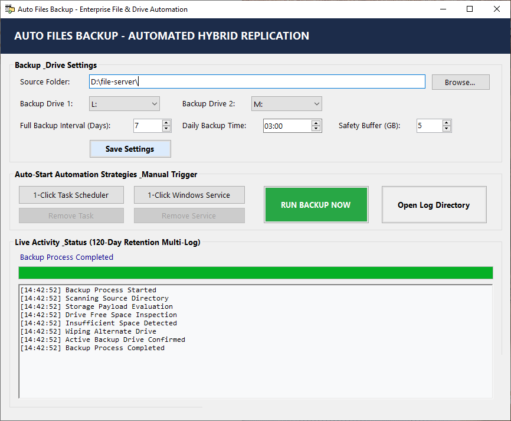
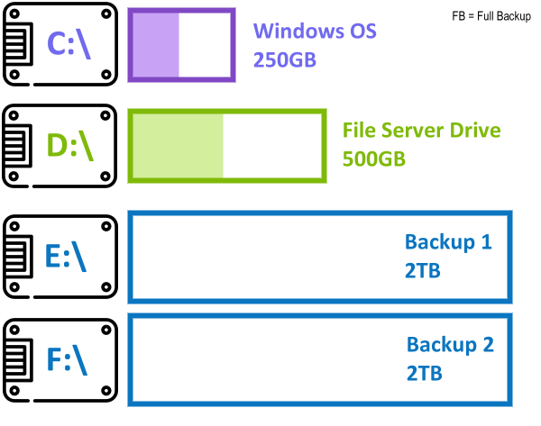
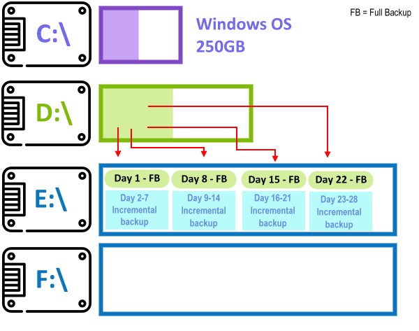
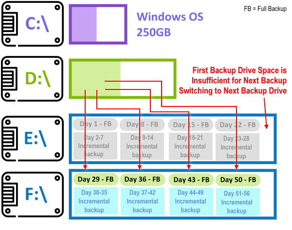
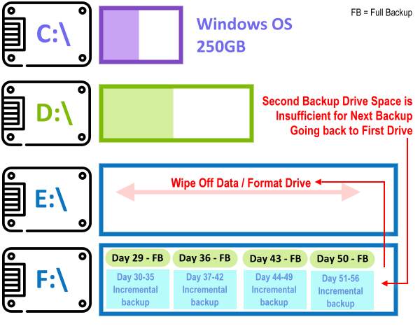

# Auto Files Backup

**Scheduled Windows folder backups. Weekly history. Restore with copy and paste.**

Auto Files Backup backs up a source folder to one or two NTFS drives. It creates a new full backup at a configurable interval, updates the current set between full backups, and rotates between drives as space runs out.

Your backups stay as ordinary files and folders. To recover, choose a completed backup set and copy its files back—no proprietary archive format or restore application required.



*Application interface shown in an earlier build. Labels and log messages may differ from the current version.*

## Why use it?

- **Simple recovery:** browse backup folders in Windows Explorer and restore with copy and paste.
- **Weekly history:** keep separate full-backup sets instead of repeatedly overwriting a single backup folder.
- **Archive-based daily updates:** use the Windows Archive attribute to select files, without reading unchanged file contents or calculating hashes.
- **Automatic drive rotation:** move to the next backup drive when space is insufficient, then recycle older managed sets as needed.
- **Keep deleted files:** removing a source file does not remove it from the current backup set.
- **Safer file replacement:** copy to a temporary destination file before replacing an existing backup, preserving the old copy when copying fails.
- **Unattended operation:** run through Windows Task Scheduler or the included Windows Service.
- **Readable status and logs:** identify completed sets, inspect failures, and review per-run statistics.

## How the backup cycle works

The following example uses a seven-day full-backup interval and two backup drives. Drive letters and capacities are examples; choose the drives that match your system.

### 1. Choose the source and backup drives

Windows runs on **C:**, the source files are on **D:**, and **E:** and **F:** provide backup storage. Backup destinations must be separate from the volumes containing the source, Windows, and this application.



### 2. Build weekly sets on the first drive

Day 1 starts a full backup. Days 2–7 update that same set. Day 8 starts another full set, leaving the earlier week unchanged. The cycle continues while space is available.

Daily updates copy files whose **Archive** attribute is set. After a successful copy, the attribute is cleared. Full backups copy every file regardless of its Archive attribute.



### 3. Switch to the second drive

When the active drive cannot accommodate the next backup plus the configured safety buffer, the application looks for space on the other drive. Switching to a new set always starts with a full backup, so restoration does not depend on files scattered across both drives.



### 4. Recycle older sets and continue

If neither drive has enough free space, the application checks whether recycling older managed sets can make room for a full backup. It prefers the alternate drive and protects the newest completed baseline on the available drives. If there is still insufficient space, it reports a failure instead of erasing that baseline.



**About the diagram:** “Wipe Off Data / Format Drive” describes the original rotation concept. The current application **does not format entire drives**. It removes only recognized older backup sets for the configured source, as needed. Unrelated files are left untouched.

With a single backup drive, older sets can also be recycled, but the only completed baseline is protected.

## Getting started

### Requirements

- Windows with **.NET Framework 4.8**.
- One source folder and at least one **NTFS** backup drive; two backup drives are recommended for rotation.
- An account able to read the source, clear its Archive attributes, and write to the backup destinations.
- Administrator privileges when installing or removing scheduled tasks or the Windows Service.

### Set up your first backup

1. Build the application using the instructions below, then open `bin\Release\AutoFilesBackup.exe`. Keep its companion DLL files with the executable.
2. Select your **Source Folder**, **Backup Drive 1**, and optionally **Backup Drive 2**.
3. Set the **Full Backup Interval**—seven days by default—and the daily backup time.
4. Set a **Safety Buffer** appropriate for your storage. The default is 5 GB; fractional values are supported.
5. Click **Save Settings**, then **RUN BACKUP NOW**.
6. Check the completion status and logs before enabling unattended backups.

Settings are stored in `backup_config.json` beside the application. Keep the application in a location where its run account can write configuration and logs.

### Choose an automation method

| Method | Behavior |
| --- | --- |
| **Task Scheduler** | Creates a daily elevated SYSTEM task that can run while users are logged out. A straightforward choice for scheduled backup jobs. |
| **Windows Service** | Runs in the background as LocalSystem or a custom account. Checks the schedule, catches up after the scheduled time, and retries failures at most hourly. |

Choose one method. The application also prevents overlapping backup runs.

The Task Scheduler installer currently creates a basic daily task. Configure missed-start recovery, retry behavior, and a suitable execution time limit in Windows Task Scheduler if needed. SYSTEM may not have permission to access network sources; use an account with the required access.

## Restore your files

Each full-backup set has this structure:

```text
E:\BackupSets\set-2026-09-13_030000-<unique-id>\
├── Backup status.txt
├── set.json
└── Data\
    ├── Documents\
    ├── Photos\
    └── ...
```

1. Browse to the backup week you want to restore.
2. Open **Backup status.txt** and choose a completed set.
3. Copy the contents of **Data** to your restore location.

Empty folders are included. The status and metadata files sit outside `Data`, so they do not become part of your restored files.

### What history is retained?

Each week is a complete folder tree that receives daily updates until the next full set starts. **Separate daily restore points are not retained.** Updating a file replaces its earlier version within the current set.

Deleted source files remain in that set and may return when you restore it. The next full set contains the source files that exist at the time of that backup. If a source file becomes corrupted or is accidentally overwritten, choose an earlier completed weekly set when necessary.

## Backup behavior and limits

- **Archive-only detection:** daily updates skip files with Archive clear—even if a destination file is missing or its size or timestamp differs. Other backup tools can also clear this shared attribute. Full backups always copy everything.
- **No hashing:** copying relies on Windows file I/O and reported errors. Neither change detection nor post-copy verification calculates content hashes.
- **Locked files:** files open for writing are reported as failures. There is no Volume Shadow Copy Service (VSS) integration; schedule backups when applications are idle.
- **Incomplete runs:** failures are logged, the set stays marked incomplete/running, and the command-line run returns a failure code. A failed daily update can leave a mixture of older and newer files in the current set.
- **Folder traversal:** the engine uses streaming scans rather than loading the entire file list into memory. Junctions and other reparse points are rejected. Protected Windows metadata folders at a source volume root are excluded.
- **File-content backups:** this is not a system image and does not promise preservation of NTFS permissions, alternate data streams, EFS semantics, or application transaction consistency.

## Logs and command line

Logs are organized under `Logs\yyyy-MM-dd` beside the application. Default retention is 120 days.

| Log | Contents |
| --- | --- |
| `events.log` | Backup activity, drive selection, recycling and errors |
| `statistic.log` | File counts, backup type, size estimates and duration |
| `success_files.log` | Successfully copied files |
| `skipped_files.log` | Files skipped during daily updates |
| `failed_files.log` | Failed files and error details |

Run an immediate backup without opening the management window:

```powershell
.\AutoFilesBackup.exe --run
```

Backup exit codes: **0** for completion, **1** for failure, including partial-file failures.

Additional commands:

```powershell
.\AutoFilesBackup.exe --install-task
.\AutoFilesBackup.exe --remove-task
.\AutoFilesBackup.exe --install-service
.\AutoFilesBackup.exe --uninstall-service
```

The `--service` argument is used by Windows to host the installed service.

## Build from source

Use Visual Studio or Visual Studio Build Tools with MSBuild and the **.NET Framework 4.8 Developer Pack**. The projects use C# 7.3.

From a Developer PowerShell or Developer Command Prompt, run:

```powershell
msbuild AutoFilesBackup.sln /p:Configuration=Release
```

The application and its dependencies are written to `bin\Release`.

## Tests

Run the automated regression suite from the repository root:

```powershell
.\tests\Run-Tests.ps1
```

The suite covers weekly history, daily updates, Archive handling, shorter files, locked sources, drive availability, recycling, insufficient capacity, incomplete backups, configuration errors, and concurrent runs.

An optional integration test writes small backup sets to **L:** and **M:** and simulates limited capacity to exercise rotation and restoration:

```powershell
.\tests\Run-Tests.ps1 -TestDrives
```

Use dedicated test drives for this option. It creates `AFB-Integration-<id>` folders, recycles sets inside them, and leaves the remaining files for inspection. It does not format the drives or install automation.
